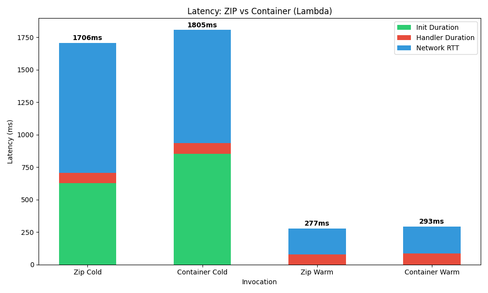
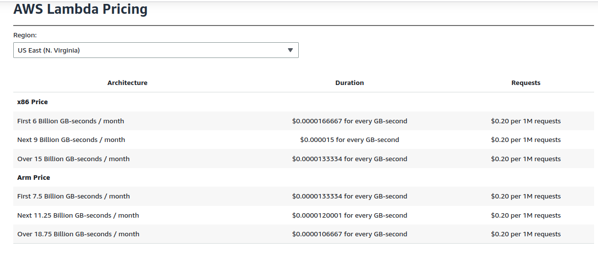
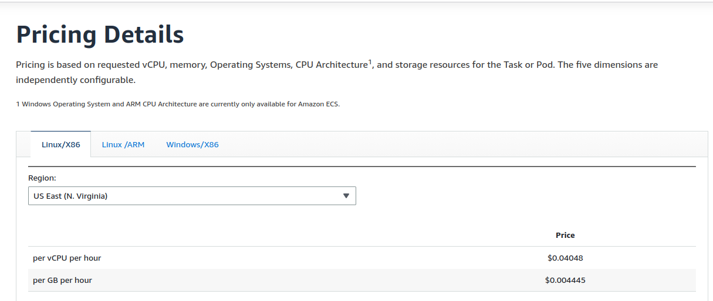
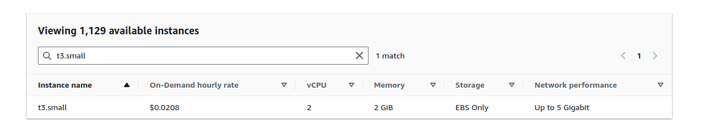
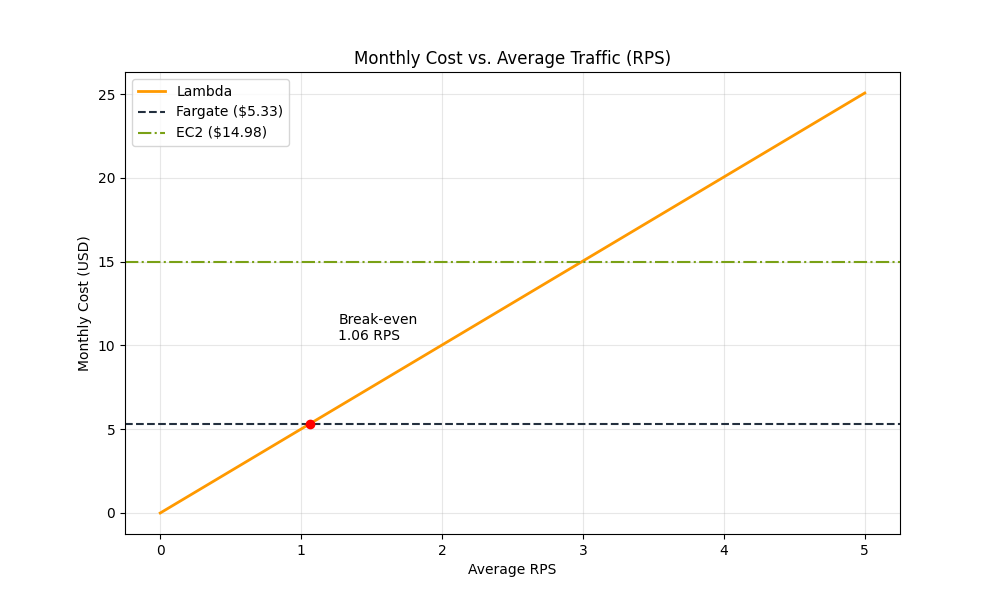

# AWS Cloud Lab — Serverless vs Containers: Latency and Cost Comparison


## Assignment 1: Deploy All Environments

```bash
root@kuba-Victus-by-HP-Laptop-16-d0xxx:/home/kuba/lsc_aws/lsc_aws# # Test via CLI invoke (bypasses Function URL auth):
aws lambda invoke --function-name lsc-knn-zip \
    --cli-binary-format raw-in-base64-out \
    --payload "$(python3 -c 'import json; q=json.load(open("loadtest/query.json")); print(json.dumps({"body": json.dumps(q)}))')" \
    /tmp/out.json
cat /tmp/out.json
{
    "StatusCode": 200,
    "ExecutedVersion": "$LATEST"
}

{"statusCode": 200, "headers": {"Content-Type": "application/json", "X-Server-Time-Ms": "63.762", "X-Instance-Id": "2026/03/28/[$LATEST]873afe8314a749d9ab37736b80f17948", "X-Cold-Start": "false"}, "body": "{\"results\": [{\"index\": 35859, \"distance\": 12.001459121704102}, {\"index\": 24682, \"distance\": 12.059946060180664}, {\"index\": 35397, \"distance\": 12.487079620361328}, {\"index\": 20160, \"distance\": 12.489519119262695}, {\"index\": 30454, \"distance\": 12.499402046203613}], \"query_time_ms\": 63.762, \"instance_id\": \"2026/03/28/[$LATEST]873afe8314a749d9ab37736b80f17948\", \"cold_start\": false}"}
root@kuba-Victus-by-HP-Laptop-16-d0xxx:/home/kuba/lsc_aws/lsc_aws# 

root@kuba-Victus-by-HP-Laptop-16-d0xxx:/home/kuba/lsc_aws/lsc_aws# aws lambda invoke --function-name lsc-knn-container \
    --cli-binary-format raw-in-base64-out \
    --payload "$(python3 -c 'import json; q=json.load(open("loadtest/query.json")); print(json.dumps({"body": json.dumps(q)}))')" \
    /tmp/out.json
cat /tmp/out.json
{
    "StatusCode": 200,
    "ExecutedVersion": "$LATEST"
}

{"statusCode": 200, "headers": {"Content-Type": "application/json", "X-Server-Time-Ms": "69.600", "X-Instance-Id": "2026/03/28/[$LATEST]be2b5a48b6fd4904b5c562750736052e", "X-Cold-Start": "false"}, "body": "{\"results\": [{\"index\": 35859, \"distance\": 12.001459121704102}, {\"index\": 24682, \"distance\": 12.059946060180664}, {\"index\": 35397, \"distance\": 12.487079620361328}, {\"index\": 20160, \"distance\": 12.489519119262695}, {\"index\": 30454, \"distance\": 12.499402046203613}], \"query_time_ms\": 69.6, \"instance_id\": \"2026/03/28/[$LATEST]be2b5a48b6fd4904b5c562750736052e\", \"cold_start\": false}"}


root@kuba-Victus-by-HP-Laptop-16-d0xxx:/home/kuba/lsc_aws/lsc_aws# curl -X POST -H "Content-Type: application/json" -d @loadtest/query.json     http://lsc-knn-alb-180738426.us-east-1.elb.amazonaws.com/search

{"instance_id":"ip-172-31-26-212.ec2.internal","query_time_ms":23.72,"results":[{"distance":12.001459121704102,"index":35859},{"distance":12.059946060180664,"index":24682},{"distance":12.487079620361328,"index":35397},{"distance":12.489519119262695,"index":20160},{"distance":12.499402046203613,"index":30454}]}


root@kuba-Victus-by-HP-Laptop-16-d0xxx:/home/kuba/lsc_aws/lsc_aws# curl -X POST -H "Content-Type: application/json" -d @loadtest/query.json     http://100.54.18.38:8080/search

{"instance_id":"c2d6c9aca4c0","query_time_ms":28.44,"results":[{"distance":12.001459121704102,"index":35859},{"distance":12.059946060180664,"index":24682},{"distance":12.487079620361328,"index":35397},{"distance":12.489519119262695,"index":20160},{"distance":12.499402046203613,"index":30454}]}

```

## Assignment 2: Scenario A — Cold Start Characterization

```bash
root@kuba-Victus-by-HP-Laptop-16-d0xxx:/home/kuba/lsc_aws/lsc_aws# aws logs filter-log-events \
    --log-group-name "/aws/lambda/lsc-knn-zip" \
    --filter-pattern "Init Duration" \
    --start-time $(date -d '30 minutes ago' +%s000) \
    --query 'events[*].message' --output text
REPORT RequestId: 8431e456-1e84-45e5-b366-b985daa3985b  Duration: 77.64 ms      Billed Duration: 706 ms Memory Size: 512 MB     Max Memory Used: 144 MB Init Duration: 627.48 ms        
XRAY TraceId: 1-69c8071e-41f36b3f118170c0509ae60d       SegmentId: bb26838a5f6651e0     Sampled: true   

```
### Zip data:

| RequestId                            | Duration (ms) | Billed Duration (ms) | Memory Size (MB) | Max Memory Used (MB) | Init Duration (ms) |
| ------------------------------------ | ------------- | -------------------- | ---------------- | -------------------- | ------------------ |
| 8431e456-1e84-45e5-b366-b985daa3985b | 77.64         | 706                  | 512              | 144                  | 627.48             |
| 0862fbc6-0f3e-4505-99c6-642a6c31e92d | 79.39         | 80                   | 512              | 144                  | -                  |
| b43e3a9b-8828-4046-a3aa-c3d4cd9df472 | 74.58         | 75                   | 512              | 144                  | -                  |
| e9ea547f-28b3-4d7b-8db7-34acf070f350 | 78.53         | 79                   | 512              | 144                  | -                  |
| 0682a4da-dbec-4f8d-b9f4-ec45b520e510 | 74.82         | 75                   | 512              | 144                  | -                  |
| 7180be79-6615-4e69-ab4a-a23a7805bb09 | 67.28         | 68                   | 512              | 144                  | -                  |
| c24dd85a-3414-4277-96fa-57ec44931e80 | 84.82         | 85                   | 512              | 144                  | -                  |
| 315e3fb3-e465-42a3-8d56-1f40e2b1936b | 74.59         | 75                   | 512              | 144                  | -                  |
| 2f8a9f61-2ac7-4562-b240-8438f3198b35 | 66.08         | 67                   | 512              | 144                  | -                  |
| 7157f969-e114-45fc-b584-c28a89081320 | 66.56         | 67                   | 512              | 144                  | -                  |
| 871773cf-c7ba-43e8-b369-469bf4ce9fcf | 79.96         | 80                   | 512              | 144                  | -                  |
| f8b8d817-707f-4cbb-9212-6b26873307d5 | 82.48         | 83                   | 512              | 144                  | -                  |
| 99d29b43-5761-40a2-bf83-b9d0eeeb1505 | 78.27         | 79                   | 512              | 144                  | -                  |
| ff7f903a-df89-476a-97cc-fb7ca444bdf3 | 82.43         | 83                   | 512              | 144                  | -                  |
| b7177586-7b13-4ca6-a49d-ee737093b32c | 78.63         | 79                   | 512              | 144                  | -                  |
| 91dddbb6-acce-4b3c-9bcd-12073c8bd0a2 | 79.51         | 80                   | 512              | 144                  | -                  |
| 750ab8ba-bb22-47ed-802e-5b6b3d93a405 | 76.01         | 77                   | 512              | 144                  | -                  |
| e0bd8bfa-7329-4fc5-8658-7e33b560918b | 72.14         | 73                   | 512              | 144                  | -                  |
| b9e5024f-2530-44b1-9978-927f37aef0dc | 71.01         | 72                   | 512              | 144                  | -                  |
| e00e914f-3b36-444a-bb1e-740d53568e5a | 70.34         | 71                   | 512              | 144                  | -                  |
| 0e284a66-4fc9-45b4-a6fd-a69926fc302c | 86.54         | 87                   | 512              | 144                  | -                  |
| f22d1f9c-9e01-46d1-8877-28b86f1fdeb3 | 77.32         | 78                   | 512              | 144                  | -                  |
| 625b9151-1548-40ca-bdc2-a70dc95eec41 | 78.77         | 79                   | 512              | 144                  | -                  |
| 68ff2f76-68e2-40a8-8b9b-7928c41a1204 | 86.70         | 87                   | 512              | 144                  | -                  |
| cd9c140f-133c-49ae-9b6c-5be782bc3177 | 79.74         | 80                   | 512              | 144                  | -                  |
| 1af5154a-f633-4e74-8882-7b98a82d3dd1 | 86.54         | 87                   | 512              | 144                  | -                  |
| 95da1bca-ae95-497f-9256-ece4e2719eeb | 78.34         | 79                   | 512              | 144                  | -                  |
| baadb1c8-8b2c-4bd0-bf11-53ef2da98932 | 86.55         | 87                   | 512              | 144                  | -                  |
| cc60fd7e-5385-496c-859d-d843859259d5 | 83.98         | 84                   | 512              | 144                  | -                  |
| 2789e483-580d-4681-acbf-06ce8730bb43 | 78.60         | 79                   | 512              | 144                  | -                  |


### Container Data:
```bash
root@kuba-Victus-by-HP-Laptop-16-d0xxx:/home/kuba/lsc_aws/lsc_aws# aws logs filter-log-events --log-group-name /aws/lambda/lsc-knn-container --start-time $(date -d '30 minutes ago' +%s000) --query 'events[*].message' --output text
START RequestId: dbc52e00-0eaa-483a-b3f5-f2d72aab8188 Version: $LATEST
        END RequestId: dbc52e00-0eaa-483a-b3f5-f2d72aab8188
        REPORT RequestId: dbc52e00-0eaa-483a-b3f5-f2d72aab8188  Duration: 85.80 ms      Billed Duration: 937 ms Memory Size: 512 MB     Max Memory Used: 143 MB Init Duration: 850.88 ms        
XRAY TraceId: 1-69c81c3d-7d44bd372789a91c2adb2b43       SegmentId: be98ef3054561022     Sampled: true   
        START RequestId: 74da5860-0831-489c-b882-93e483d286b8 Version: $LATEST
        END RequestId: 74da5860-0831-489c-b882-93e483d286b8
        REPORT RequestId: 74da5860-0831-489c-b882-93e483d286b8  Duration: 82.88 ms      Billed Duration: 83 ms  Memory Size: 512 MB     Max Memory Used: 143 MB 
XRAY TraceId: 1-69c81c3e-40ec8820405a8ec54ea4f79a       SegmentId: 1d8125d5cb16e0a8     Sampled: true   
        START RequestId: 1dff116b-4639-4ee1-ab0c-305afb341c80 Version: $LATEST
        END RequestId: 1dff116b-4639-4ee1-ab0c-305afb341c80
        REPORT RequestId: 1dff116b-4639-4ee1-ab0c-305afb341c80  Duration: 100.47 ms     Billed Duration: 101 ms Memory Size: 512 MB     Max Memory Used: 143 MB 
XRAY TraceId: 1-69c81c3e-56a05ba91ae2cd03558b1eed       SegmentId: 89ba8760de442761     Sampled: true   
        START RequestId: 421892aa-d1c5-4830-b1bd-98ad2767cfa4 Version: $LATEST
        END RequestId: 421892aa-d1c5-4830-b1bd-98ad2767cfa4
        REPORT RequestId: 421892aa-d1c5-4830-b1bd-98ad2767cfa4  Duration: 121.77 ms     Billed Duration: 122 ms Memory Size: 512 MB     Max Memory Used: 143 MB 
XRAY TraceId: 1-69c81c3f-47bc3ef26258d65f56b129f0       SegmentId: 9207c08b66552215     Sampled: true   
        START RequestId: 0ed69956-9066-4f9e-8c4f-30310448f7d4 Version: $LATEST
        END RequestId: 0ed69956-9066-4f9e-8c4f-30310448f7d4
        REPORT RequestId: 0ed69956-9066-4f9e-8c4f-30310448f7d4  Duration: 79.64 ms      Billed Duration: 80 ms  Memory Size: 512 MB     Max Memory Used: 143 MB 
XRAY TraceId: 1-69c81c40-64a85b42150d34e65c34473a       SegmentId: de76857cabb27a25     Sampled: true   
        START RequestId: e58c5427-42cd-4d26-bf80-4e7a3b5c84b7 Version: $LATEST
        END RequestId: e58c5427-42cd-4d26-bf80-4e7a3b5c84b7
        REPORT RequestId: e58c5427-42cd-4d26-bf80-4e7a3b5c84b7  Duration: 86.55 ms      Billed Duration: 87 ms  Memory Size: 512 MB     Max Memory Used: 143 MB 
XRAY TraceId: 1-69c81c41-629a8525334e827944cd485d       SegmentId: 7fae98e6277dc102     Sampled: true   
        START RequestId: 7617beab-5959-48f3-bcf7-967e6b7a91da Version: $LATEST
        END RequestId: 7617beab-5959-48f3-bcf7-967e6b7a91da
        REPORT RequestId: 7617beab-5959-48f3-bcf7-967e6b7a91da  Duration: 83.97 ms      Billed Duration: 84 ms  Memory Size: 512 MB     Max Memory Used: 143 MB 
XRAY TraceId: 1-69c81c42-6d188a241e910b793ba0dc9a       SegmentId: d1609561fca7f99a     Sampled: true   
        START RequestId: 77e6cb66-1771-4c39-8325-25a622b1b47f Version: $LATEST
        END RequestId: 77e6cb66-1771-4c39-8325-25a622b1b47f
        REPORT RequestId: 77e6cb66-1771-4c39-8325-25a622b1b47f  Duration: 82.07 ms      Billed Duration: 83 ms  Memory Size: 512 MB     Max Memory Used: 143 MB 
XRAY TraceId: 1-69c81c43-0ed37ce9711d2e1f60163f56       SegmentId: c84f48e279780937     Sampled: true   
        START RequestId: ebdbe76d-1cd9-4e96-b87a-5135b6e63168 Version: $LATEST
        END RequestId: ebdbe76d-1cd9-4e96-b87a-5135b6e63168
        REPORT RequestId: ebdbe76d-1cd9-4e96-b87a-5135b6e63168  Duration: 78.42 ms      Billed Duration: 79 ms  Memory Size: 512 MB     Max Memory Used: 143 MB 
XRAY TraceId: 1-69c81c44-201001e274ff647b09b253c3       SegmentId: 2c28b55c60377690     Sampled: true   
        START RequestId: fc248ecd-f053-4664-aa01-f11df5247c09 Version: $LATEST
        END RequestId: fc248ecd-f053-4664-aa01-f11df5247c09
        REPORT RequestId: fc248ecd-f053-4664-aa01-f11df5247c09  Duration: 86.30 ms      Billed Duration: 87 ms  Memory Size: 512 MB     Max Memory Used: 143 MB 
XRAY TraceId: 1-69c81c45-438e2f9a2f75dcf62da953f5       SegmentId: 5fbd76c82222c2f2     Sampled: true   
        START RequestId: 7609b877-d6b3-4b20-9303-34de5a2529e6 Version: $LATEST
        END RequestId: 7609b877-d6b3-4b20-9303-34de5a2529e6
        REPORT RequestId: 7609b877-d6b3-4b20-9303-34de5a2529e6  Duration: 70.97 ms      Billed Duration: 71 ms  Memory Size: 512 MB     Max Memory Used: 143 MB 
XRAY TraceId: 1-69c81c46-09198ef03b7fdd1000dacf19       SegmentId: 0125270d6093545c     Sampled: true   
        START RequestId: 28409b4b-2175-4904-8cfe-4b8aff30704f Version: $LATEST
        END RequestId: 28409b4b-2175-4904-8cfe-4b8aff30704f
        REPORT RequestId: 28409b4b-2175-4904-8cfe-4b8aff30704f  Duration: 75.16 ms      Billed Duration: 76 ms  Memory Size: 512 MB     Max Memory Used: 143 MB 
XRAY TraceId: 1-69c81c47-1130caac7f221eee74486a9f       SegmentId: df7700b33b5fddfe     Sampled: true   
        START RequestId: 54fd253f-69c8-48e1-b6f4-12c62368c87e Version: $LATEST
        END RequestId: 54fd253f-69c8-48e1-b6f4-12c62368c87e
        REPORT RequestId: 54fd253f-69c8-48e1-b6f4-12c62368c87e  Duration: 87.22 ms      Billed Duration: 88 ms  Memory Size: 512 MB     Max Memory Used: 143 MB 
XRAY TraceId: 1-69c81c48-1e0abb72242a119c5baa5b1b       SegmentId: f05544d08113282f     Sampled: true   
        START RequestId: db017de3-46b1-4b55-aaf5-7fa16eabd579 Version: $LATEST
        END RequestId: db017de3-46b1-4b55-aaf5-7fa16eabd579
        REPORT RequestId: db017de3-46b1-4b55-aaf5-7fa16eabd579  Duration: 90.03 ms      Billed Duration: 91 ms  Memory Size: 512 MB     Max Memory Used: 143 MB 
XRAY TraceId: 1-69c81c49-0412c1350c8925a525319aa6       SegmentId: 8f43d5f6b07b8330     Sampled: true   
        START RequestId: e9b3e4e9-59e7-42d6-9851-9c1648092bdb Version: $LATEST
        END RequestId: e9b3e4e9-59e7-42d6-9851-9c1648092bdb
        REPORT RequestId: e9b3e4e9-59e7-42d6-9851-9c1648092bdb  Duration: 71.98 ms      Billed Duration: 72 ms  Memory Size: 512 MB     Max Memory Used: 143 MB 
XRAY TraceId: 1-69c81c4a-627c042b7e1506a66c7eecf1       SegmentId: 4071e285d98b0560     Sampled: true   
        START RequestId: 861903cb-e872-4de1-ac18-9edd6a6c3df9 Version: $LATEST
        END RequestId: 861903cb-e872-4de1-ac18-9edd6a6c3df9
        REPORT RequestId: 861903cb-e872-4de1-ac18-9edd6a6c3df9  Duration: 83.87 ms      Billed Duration: 84 ms  Memory Size: 512 MB     Max Memory Used: 143 MB 
XRAY TraceId: 1-69c81c4b-16bbe87c25e242db50a2ec50       SegmentId: de1ee33048526e80     Sampled: true   
        START RequestId: 3be929aa-2672-456b-aa36-9ff0418cedbc Version: $LATEST
        END RequestId: 3be929aa-2672-456b-aa36-9ff0418cedbc
        REPORT RequestId: 3be929aa-2672-456b-aa36-9ff0418cedbc  Duration: 86.14 ms      Billed Duration: 87 ms  Memory Size: 512 MB     Max Memory Used: 143 MB 
XRAY TraceId: 1-69c81c4c-333b463645822b9d085ea940       SegmentId: 03c37739221fd29e     Sampled: true   
        START RequestId: 9ce68c93-b610-466e-93af-11f0038be4d7 Version: $LATEST
        END RequestId: 9ce68c93-b610-466e-93af-11f0038be4d7
        REPORT RequestId: 9ce68c93-b610-466e-93af-11f0038be4d7  Duration: 86.63 ms      Billed Duration: 87 ms  Memory Size: 512 MB     Max Memory Used: 143 MB 
XRAY TraceId: 1-69c81c4d-69b36cea4638fa7d7d39ea7b       SegmentId: afd9c0e8cbdc7d6c     Sampled: true   
        START RequestId: 2fbf0a44-e817-401d-a033-b5e9e44f9dd4 Version: $LATEST
        END RequestId: 2fbf0a44-e817-401d-a033-b5e9e44f9dd4
        REPORT RequestId: 2fbf0a44-e817-401d-a033-b5e9e44f9dd4  Duration: 86.25 ms      Billed Duration: 87 ms  Memory Size: 512 MB     Max Memory Used: 143 MB 
XRAY TraceId: 1-69c81c4e-4ba2aeb174fd8ae951c56481       SegmentId: 600e4a1705943197     Sampled: true   
        START RequestId: 2426bc98-0f75-4ebc-ae62-8bddb0a1e821 Version: $LATEST
        END RequestId: 2426bc98-0f75-4ebc-ae62-8bddb0a1e821
        REPORT RequestId: 2426bc98-0f75-4ebc-ae62-8bddb0a1e821  Duration: 101.52 ms     Billed Duration: 102 ms Memory Size: 512 MB     Max Memory Used: 143 MB 
XRAY TraceId: 1-69c81c4f-5d0d11e32d5435143291edbe       SegmentId: bb357efd7883fb10     Sampled: true   
        START RequestId: ac272a3f-3201-44a8-9fca-d9441a24e40c Version: $LATEST
        END RequestId: ac272a3f-3201-44a8-9fca-d9441a24e40c
        REPORT RequestId: ac272a3f-3201-44a8-9fca-d9441a24e40c  Duration: 79.05 ms      Billed Duration: 80 ms  Memory Size: 512 MB     Max Memory Used: 143 MB 
XRAY TraceId: 1-69c81c50-0c049e4d561676e13c414ca6       SegmentId: 8a480162acf3d6ea     Sampled: true   
        START RequestId: 4c36ada9-29ce-446e-90a5-fdbecb53a7c7 Version: $LATEST
        END RequestId: 4c36ada9-29ce-446e-90a5-fdbecb53a7c7
        REPORT RequestId: 4c36ada9-29ce-446e-90a5-fdbecb53a7c7  Duration: 83.13 ms      Billed Duration: 84 ms  Memory Size: 512 MB     Max Memory Used: 143 MB 
XRAY TraceId: 1-69c81c51-07297a04086e6eb85f31983e       SegmentId: f7aedfddf63f2871     Sampled: true   
        START RequestId: 39cf23c0-c4c1-45a1-b3c3-d9872404cb20 Version: $LATEST
        END RequestId: 39cf23c0-c4c1-45a1-b3c3-d9872404cb20
        REPORT RequestId: 39cf23c0-c4c1-45a1-b3c3-d9872404cb20  Duration: 93.15 ms      Billed Duration: 94 ms  Memory Size: 512 MB     Max Memory Used: 143 MB 
XRAY TraceId: 1-69c81c52-5f88372f56fc9cc47dc73352       SegmentId: 8e4580dc699dd856     Sampled: true   
        START RequestId: 68f35c22-e6e4-4f9d-a0de-9b5c69eda16c Version: $LATEST
        END RequestId: 68f35c22-e6e4-4f9d-a0de-9b5c69eda16c
        REPORT RequestId: 68f35c22-e6e4-4f9d-a0de-9b5c69eda16c  Duration: 118.11 ms     Billed Duration: 119 ms Memory Size: 512 MB     Max Memory Used: 143 MB 
XRAY TraceId: 1-69c81c53-6d3540c21230c7e91aa35e0e       SegmentId: 59d2a679c79ff48b     Sampled: true   
        START RequestId: 6cec84f3-1418-4545-940a-8cb05a5bbd38 Version: $LATEST
        END RequestId: 6cec84f3-1418-4545-940a-8cb05a5bbd38
        REPORT RequestId: 6cec84f3-1418-4545-940a-8cb05a5bbd38  Duration: 79.64 ms      Billed Duration: 80 ms  Memory Size: 512 MB     Max Memory Used: 143 MB 
XRAY TraceId: 1-69c81c54-566925a730a1c234594d5fea       SegmentId: fa7b4280dc024dca     Sampled: true   
        START RequestId: affd01fa-396a-4ccf-bdc9-7f0a9ab01490 Version: $LATEST
        END RequestId: affd01fa-396a-4ccf-bdc9-7f0a9ab01490
        REPORT RequestId: affd01fa-396a-4ccf-bdc9-7f0a9ab01490  Duration: 87.38 ms      Billed Duration: 88 ms  Memory Size: 512 MB     Max Memory Used: 143 MB 
XRAY TraceId: 1-69c81c55-3c3db6b56d926abb5d91ccaa       SegmentId: 67081c954f8b35d0     Sampled: true   
        START RequestId: 720c7c38-14e6-4e44-ad65-9e5b224f0941 Version: $LATEST
        END RequestId: 720c7c38-14e6-4e44-ad65-9e5b224f0941
        REPORT RequestId: 720c7c38-14e6-4e44-ad65-9e5b224f0941  Duration: 73.19 ms      Billed Duration: 74 ms  Memory Size: 512 MB     Max Memory Used: 143 MB 
XRAY TraceId: 1-69c81c56-5249068f1cfc06e02111836f       SegmentId: cac1f617431f1560     Sampled: true   
        START RequestId: 58828c07-6332-43ec-82d2-d6e1fbbd1b8f Version: $LATEST
        END RequestId: 58828c07-6332-43ec-82d2-d6e1fbbd1b8f
        REPORT RequestId: 58828c07-6332-43ec-82d2-d6e1fbbd1b8f  Duration: 71.84 ms      Billed Duration: 72 ms  Memory Size: 512 MB     Max Memory Used: 143 MB 
XRAY TraceId: 1-69c81c57-78cbf9b23cc3087f5c591c1d       SegmentId: 0d9a1333dbc09978     Sampled: true   
        START RequestId: 54d98a64-f170-417c-8eca-df2d899c3355 Version: $LATEST
        END RequestId: 54d98a64-f170-417c-8eca-df2d899c3355
        REPORT RequestId: 54d98a64-f170-417c-8eca-df2d899c3355  Duration: 92.17 ms      Billed Duration: 93 ms  Memory Size: 512 MB     Max Memory Used: 143 MB 
XRAY TraceId: 1-69c81c58-3dd4bea02e8e63d0221b87fb       SegmentId: 88cd1148fcd067b1     Sampled: true   
        START RequestId: f719a7c5-dc4e-469a-879a-c495e17c1c55 Version: $LATEST
        END RequestId: f719a7c5-dc4e-469a-879a-c495e17c1c55
        REPORT RequestId: f719a7c5-dc4e-469a-879a-c495e17c1c55  Duration: 71.45 ms      Billed Duration: 72 ms  Memory Size: 512 MB     Max Memory Used: 143 MB 
XRAY TraceId: 1-69c81c59-3298f19c6b3c1ae83d637ab3       SegmentId: 201d5c4fedab4aef     Sampled: true   
```


| Invocation                            | Init Duration (ms) | Handler Duration (ms) | Total Latency (ms) | Network RTT(ms) 
| ------------------------------------ | ------------- | -------------------- | ---------------- | -------------------- |
| Zip Cold Start | 77.64         | 627.48                  | 77.64              | 1706.20          |  1001.08         
| Zip Warm Start| 79.39         | 0.00                   | ~=77.95              | 277.90                  |199.95
| Container Cold Start | 77.64         | 850.88                  | 85.80             | 1805.50        |  868.82       
| Container Warm Start| 79.39         | 0.00                   | ~=85.82             | 293.10                  |207.28




Zip starts faster than Container because ZIPs are simple archives that are extracted into runtime, and containers require pulling and mouning filesystem. AWS just need to process more data to initialize environment for containers than for zips.

## Assignment 3: Scenario B — Warm Steady-State Throughput

| Environment        | Concurrency | p50 (ms) | p95 (ms) | p99 (ms) | Server avg (ms) |
| ------------------ | ----------- | -------- | -------- | -------- | --------------- |
| **Lambda (zip)**       | 5           | 218.3275 | 246.3499 | 562.8071 |    383.8205     |
| **Lambda (zip)**       | 10          | 208.1125 | 236.6815 | 553.3348 |   342.9421      |
| **Lambda (container)** | 5           | 214.4053 | 238.1121 | 564.1981 | 355.8310        |
| **Lambda (container)** | 10          | 210.7827 | 243.1015 | 635.1353 |     428.8550    |
| Fargate            | 10          | 813.9    | 1089.9   | 1194.1   |  192.0          |
| Fargate            | 50          | 4124.5   | 4711.2   |  4854.4  |  138.4          |
| EC2                | 10          | 290.3425 | 401.5059 |457.3575  | 120.1335        |
| EC2                | 50          | 897.6    | 1072.2   | 1267.3   | 120.3           |

Lambda p50 barely changes between c=5 and c=10 because every lambda can run separate execution environment for every parallel request, this results in no queue.

Fargate and EC2 have single instances which forces requests to wait in queue. With c=50 the queue grows bigger which results in p50 also growing bigger.

Difference between query_time_ms and client-side p50 is a result of how these values are measured. query_time_ms reflects only time the server spend processing the request, while client-side p50 reflect total time experienced by the client, and that can include network communication, request forwarding. That's why client-side is a bigger value.


## Assginment 4:
There are 10 cold starts for zip and for container.


```bash
root@kuba-Victus-by-HP-Laptop-16-d0xxx:/home/kuba/lsc_aws/lsc_aws# aws logs filter-log-events --log-group-name /aws/lambda/lsc-knn-container --filter-pattern 'Init Duration' --start-time $(date -d '20 minutes ago' +%s000) --query 'events[*].message' --output text
REPORT RequestId: fb792d97-1bab-4fc5-b444-f6fcc3e1f7a5  Duration: 68.56 ms      Billed Duration: 549 ms Memory Size: 512 MB     Max Memory Used: 143 MB Init Duration: 479.78 ms        
XRAY TraceId: 1-69c82416-2103d15358c686eb57c61436       SegmentId: f9c165e1d62d2dcf     Sampled: true   
        REPORT RequestId: 5c0334ac-78dd-49a6-a68b-f649039e8e70  Duration: 36.16 ms      Billed Duration: 567 ms Memory Size: 512 MB     Max Memory Used: 142 MB Init Duration: 529.96 ms        
XRAY TraceId: 1-69c82416-1b7443ea67dfef4352ecdaf9       SegmentId: a44d702e069e7391     Sampled: true   
        REPORT RequestId: b8abd7c1-35f1-4748-b881-e41790d83d42  Duration: 85.14 ms      Billed Duration: 662 ms Memory Size: 512 MB     Max Memory Used: 142 MB Init Duration: 576.26 ms        
XRAY TraceId: 1-69c82416-5d56d3927a5a442338f7505c       SegmentId: e512cadf87dd4804     Sampled: true   
        REPORT RequestId: 41a712b1-e9da-4b03-b0c1-622b026f964c  Duration: 79.19 ms      Billed Duration: 659 ms Memory Size: 512 MB     Max Memory Used: 142 MB Init Duration: 579.60 ms        
XRAY TraceId: 1-69c82416-13f5dbd45f72052200cd8ef8       SegmentId: b2586df5524374d9     Sampled: true   
        REPORT RequestId: 3d4bf995-eee6-47f7-97f5-57f55e7db8a5  Duration: 86.00 ms      Billed Duration: 663 ms Memory Size: 512 MB     Max Memory Used: 142 MB Init Duration: 576.60 ms        
XRAY TraceId: 1-69c82416-27729b1523b449244327e983       SegmentId: d5167ddb3c9768df     Sampled: true   
        REPORT RequestId: cd29703b-0127-4868-a524-ba5ecb1cd0da  Duration: 80.62 ms      Billed Duration: 691 ms Memory Size: 512 MB     Max Memory Used: 142 MB Init Duration: 610.19 ms        
XRAY TraceId: 1-69c82416-5fac2a5434a7f8780ba0ef9a       SegmentId: d2e2fc66e0298b53     Sampled: true   
        REPORT RequestId: 79a0ec36-ec5e-4666-8c22-bfd201195def  Duration: 88.37 ms      Billed Duration: 685 ms Memory Size: 512 MB     Max Memory Used: 143 MB Init Duration: 596.05 ms        
XRAY TraceId: 1-69c82416-0d6c588e24dafc507cca42a2       SegmentId: 252497ea72cbbfde     Sampled: true   
        REPORT RequestId: d07aecb3-4d3c-471e-acd1-9a6ff75f625a  Duration: 83.86 ms      Billed Duration: 733 ms Memory Size: 512 MB     Max Memory Used: 142 MB Init Duration: 648.96 ms        
XRAY TraceId: 1-69c82416-3de6bfc30d91beb0205d10a4       SegmentId: db18be8258d4dc6c     Sampled: true   
        REPORT RequestId: f9578159-2eb6-4c2e-a95a-5e6ed319e6d0  Duration: 85.35 ms      Billed Duration: 747 ms Memory Size: 512 MB     Max Memory Used: 142 MB Init Duration: 661.61 ms        
XRAY TraceId: 1-69c82416-179da0043d867042471e4d0b       SegmentId: 19dffa95429ff8a1     Sampled: true   
        REPORT RequestId: f37fe7a6-619f-4e62-bf7c-cfc99d76de58  Duration: 76.37 ms      Billed Duration: 709 ms Memory Size: 512 MB     Max Memory Used: 143 MB Init Duration: 632.18 ms        
XRAY TraceId: 1-69c82416-75549f79021e2d3d5729b399       SegmentId: c6b8c9688c105e71     Sampled: true  
```

```bash
root@kuba-Victus-by-HP-Laptop-16-d0xxx:/home/kuba/lsc_aws/lsc_aws# aws logs filter-log-events --log-group-name /aws/lambda/lsc-knn-zip --filter-pattern 'Init Duration' --start-time $(date -d '20 minutes ago' +%s000) --query 'events[*].message' --output text
REPORT RequestId: 5a971804-a6a8-40d9-9638-4dff0df552d1  Duration: 37.18 ms      Billed Duration: 584 ms Memory Size: 512 MB     Max Memory Used: 144 MB Init Duration: 545.92 ms        
XRAY TraceId: 1-69c82416-339f28825de1681e2e8aad27       SegmentId: 0ad510234132b8a7     Sampled: true   
        REPORT RequestId: c72cb14b-d8c7-4abc-87ca-120f6c721108  Duration: 73.55 ms      Billed Duration: 691 ms Memory Size: 512 MB     Max Memory Used: 144 MB Init Duration: 617.26 ms        
XRAY TraceId: 1-69c82416-53a561757174a9e95cda6b21       SegmentId: ee08be5377d3a638     Sampled: true   
        REPORT RequestId: 66eb1c0e-d772-4f23-9185-a642dc88532a  Duration: 85.55 ms      Billed Duration: 687 ms Memory Size: 512 MB     Max Memory Used: 144 MB Init Duration: 600.70 ms        
XRAY TraceId: 1-69c82416-5451c6964f01925916ef2e71       SegmentId: eedd9e9a2eee36fa     Sampled: true   
        REPORT RequestId: 2b00603e-9ce7-47ee-bee0-bf0bec3af080  Duration: 85.94 ms      Billed Duration: 697 ms Memory Size: 512 MB     Max Memory Used: 144 MB Init Duration: 610.54 ms        
XRAY TraceId: 1-69c82416-79b7082f474927780782b24d       SegmentId: 827549a249b10247     Sampled: true   
        REPORT RequestId: a348536f-ca09-4634-bd46-ed6f15352398  Duration: 85.20 ms      Billed Duration: 707 ms Memory Size: 512 MB     Max Memory Used: 144 MB Init Duration: 621.16 ms        
XRAY TraceId: 1-69c82416-3b9a00681f893b5c71949087       SegmentId: 9e5f6863b731bd52     Sampled: true   
        REPORT RequestId: d44a3856-0692-4d04-95ad-80ec7889fb72  Duration: 77.54 ms      Billed Duration: 712 ms Memory Size: 512 MB     Max Memory Used: 144 MB Init Duration: 634.16 ms        
XRAY TraceId: 1-69c82416-0a32ccb029d794ca53342886       SegmentId: 9bf43d6eb8759166     Sampled: true   
        REPORT RequestId: 027b80bb-c388-408d-bfeb-5b73efccba39  Duration: 85.67 ms      Billed Duration: 723 ms Memory Size: 512 MB     Max Memory Used: 144 MB Init Duration: 637.15 ms        
XRAY TraceId: 1-69c82416-20144d2f3241ca772a13dbf9       SegmentId: 37a02a4ee2530c68     Sampled: true   
        REPORT RequestId: 792fbe5a-8961-4708-89ba-0985210bf7da  Duration: 92.40 ms      Billed Duration: 720 ms Memory Size: 512 MB     Max Memory Used: 144 MB Init Duration: 627.48 ms        
XRAY TraceId: 1-69c82416-4565d4d900a4ec05551c7bd2       SegmentId: 5535fb416125d62b     Sampled: true   
        REPORT RequestId: 02599d0d-1e37-4faa-834a-cf12080ef792  Duration: 80.89 ms      Billed Duration: 701 ms Memory Size: 512 MB     Max Memory Used: 144 MB Init Duration: 619.25 ms        
XRAY TraceId: 1-69c82416-58155e6844b387a16f32467b       SegmentId: a15a03c87155bc13     Sampled: true   
        REPORT RequestId: d81655d3-7128-4a53-8adb-f29151e5139d  Duration: 92.70 ms      Billed Duration: 752 ms Memory Size: 512 MB     Max Memory Used: 144 MB Init Duration: 658.91 ms        
XRAY TraceId: 1-69c82416-7321901a3ee7e907796a41dc       SegmentId: c20e4f831c34d05b     Sampled: true   
```

|                    | p50       | p95   | p99   | max latency  |
| ------------------ | --------- | ----- | ----- | ----- |
| Lambda (ZIP)       | 0.21s     | 1.25s | 1.44s | 1.44s |
| Lambda (Container) | 0.21s     | 1.41s | 1.59s | 1.59s |
| Fargate            | 4.19s     | 4.50s | 4.73s | 4.74s |
| EC2                | -         | —     | —     | —     |


### Why Lambda's burst p99 is much higher than Fargate/EC2.

Lambda shows much higher p99 latency due to cold starts after the idle period. New execution environments must be initialized, which adds ~1–1.5s latency. Fargate and EC2 are already running.

### bimodal distribution in Lambda latencies (warm cluster vs. cold-start cluster).

Around 90% of request is warm cluster and they take only around 0.2s. The second cluster are cold requests, they add up to around 10% and take 1.2s-1.6s.

### State whether Lambda meets the p99 < 500ms SLO under burst. If not, explain what would need to change.

No it doesn't. To change it I would need to eliminate cold starts from the critical path. It could be done by keeping functions warm (sending them pings), increasing concurenncy limit but the best solution would be to keep a number of environment warm and ready to go. 


## Assignment 5: Cost at Zero Load





### 18 hours/day idle

- **Lambda:** $0 — for idle, Lambda function is free, you pay for requests.  
- **Fargate:**  18h * 31days * (0.5vCPU * 0.01333108$ + 1GB * 0.00146385$) ~= 4.52$
- **EC2:**  18h * 31days * 0.0208$ ~= 11.62$

**Total price:** 16.12$  

---

### 6 hours/day active

- **Lambda:** Hard to predict, it depends how many on number of requests. 
- **Fargate:**  6h * 31days * (0.5vCPU * 0.01333108$ + 1GB * 0.00146385$) ~= 1.51$
- **EC2:**  6h * 31days * 0.0208$ ~= 3.87$ 

**Total price:** 5.38$ + Lambda cost


## Assignment 6: Cost Model, Break-Even, and Recommendation


### Peak: 100 RPS * 1800s * 30days = 5 400 000 requests
### Normal: 5 RPS * 19900s * 30days = 2 970 500 requests
### Idle: 0 requests

### Total requests = 8 370 000
### duration_seconds = 0.2081125 s
### memory_GB = 0.5 GB

### Monthly cost = (requests/month × $0.20/1M) + (GB-seconds/month × $0.0000166667)
### GB-seconds   = requests × duration_seconds × memory_GB

### Lamba Cost
    (8 370 000/1 000 000 * 0.2$) + (8 370 000 * 0.2081125 * 0.5 * $0.0000166667) ~= 1,674 + 14.458 ~= 16.132$

### Fargate Cost
    Monthly Cost: 24h * 30days * (0.5 * $0.01333108)+(0.5 * $0.00146385)= 5.33$

### EC2 Cost
    30 * 24 * 0.0208$ = 14.98$


### Break-even
    x - average number of requests per day

    (x/1 000 000 * 0.2) + (x*0.2081125*0.5*0.0000166667) > 5.33

    0.0000002x + 0.0000017x > 5.33
    0.0000019x > 5.33
    x > 2 805 263

    RPS ~= 2 805 263/(30*24*3600) ~= 1.08 RPS

    Break-even points is roughly estimated at 1.08 RPS, at this points Fargate becomes cheaper than Lambda.





# Recommendation - not done
